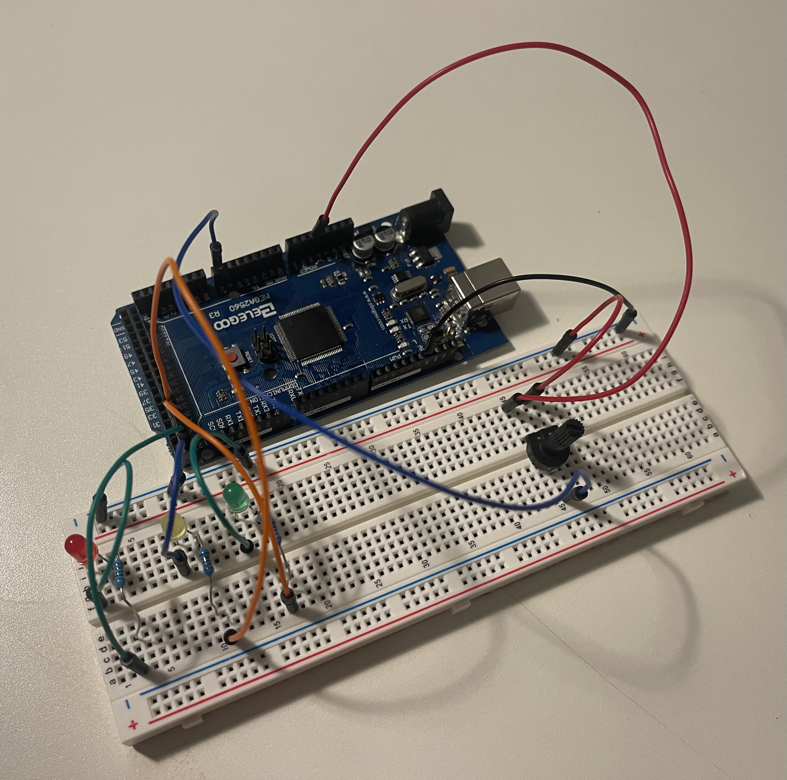

# LED Voltage Indicator

This project uses a potentiometer and three LEDs (green, yellow, and red) to indicate voltage levels. 

| Voltage Range (V) | LED Color | Meaning     |
|-------------------|-----------|-------------|
| Below 3.0V        | Green     | ✅ Safe      |
| 3.0V to 4.0V      | Yellow    | ⚠️ Warning   |
| Above 4.0V        | Red       | 🔴 Danger    |

## Key Takeaways 

- Using a DMM to test resistors
- Controlling a potentiometer
- Using if statements in C++

## Images

